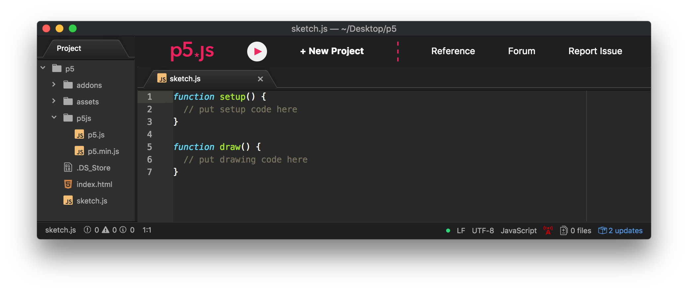
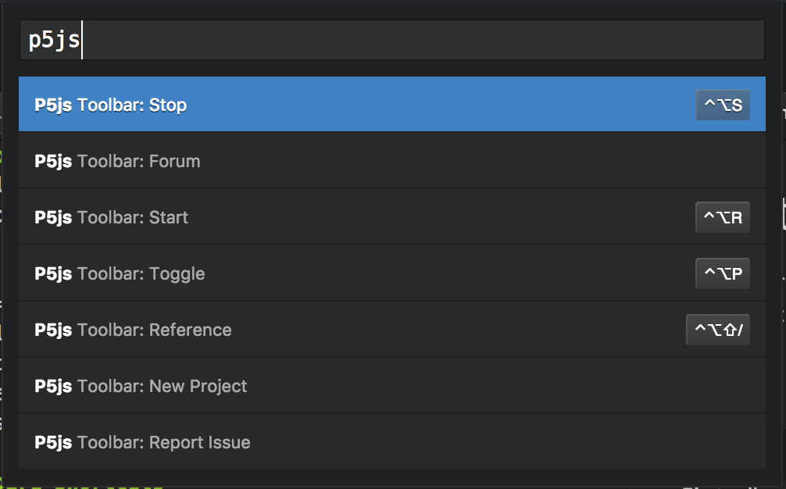
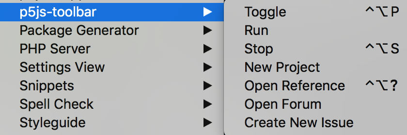

# p5js-toolbar
p5js-toolbar adds helpful tools and a built in server for quick [p5js](http://p5js.org) project development to [atom.io](http://atom.io)!

### GUI

p5js toolbar features a play/stop button to run/stop a localhost server. A new project button to create a default project with the latest version of p5js and open it in a new atom window automatically. It also provides quick links to common p5js resources.

### Keyboard Shortcuts
Task              | Command
------------------|----------------------
Open the toolbar: | Control + Option + p
Start Server:     | Control + Option + r
Stop Server:      | Control + Option + s
Open Reference    | Control + Option + ?

### Command Palette & Packages Menu
p5js-toolbar supports atom's built in command palette accessible via `Command + Shift + p`. p5js-toolbar's functionality is also accessible via atom's Packages menu

##### TODO
+ add offline Reference
+ add ability to name your project when creating a new one (any help on this greatly appreciated)
